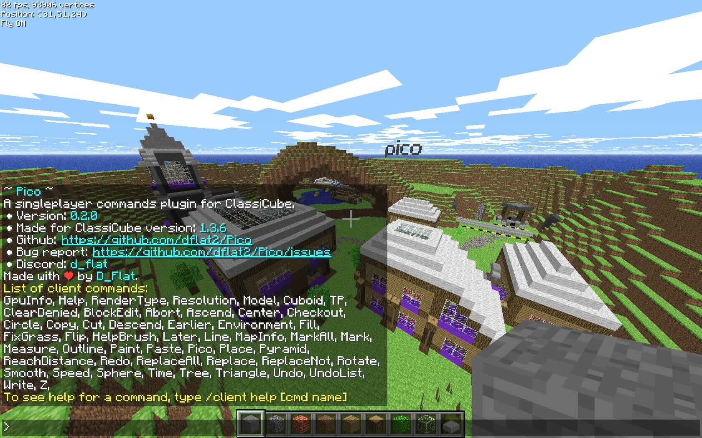

# Pico



This project is still _work in progress_ and is not fully documented yet (but most `/help <command>` messages are pretty self-explanatory). Pico aims to support most building features found on server softwares such as MCGalaxy or LegendCraft. This includes:

+ Undoing
+ Copy/pasting
+ Repeating commands
+ Brushes
+ All basic drawing commands: `/Fill`, `/Outline`, `/Tree`, etc.
+ Many convenient commands: `/Ascend`, `/ReachDistance`, `/Mark`, etc.

## Download

[Download Pico from here](https://github.com/dflat2/Pico/releases/tag/0.1.0).

## Installing

To install the plugin, move `pico.dylib` (or `.dll` or `.so`) in the `ClassiCube/plugins` directory.

## Compiling

Before compiling, clone the repository. The `--recurse-submodules` option will also clone the `ClassiCube` submodule (required for resolving header files).

```bash
git clone --recurse-submodules https://github.com/dflat2/pico.git
cd pico
```

### Linux

You must have a C compiler installed (for example [gcc](https://gcc.gnu.org/install/), which can be installed with `apt install build-essential` on Ubuntu). Then, run this command from the root directory of the repository:

```bash
gcc `find src/ -name '*.c'` -I. -I./src -o pico.so -shared -fPIC
```

You may need to add `-lm` after `find src/ -name`, as some object files require `<math.h>`.

### Mac

Run this command from the root directory of the repository.

```bash
gcc `find src/ -name '*.c'` -I. -I./src -o pico.dylib -shared -undefined dynamic_lookup
```

**Note.** If your Mac supports `arm` *and* if you downloaded ClassiCube from <https://classicube.net>, you will probably need to append `-arch x86_64` (otherwise it will compile for `arm` and not work as the client is on `x86_64`).

### Windows

I did not test compiling on Windows yet. But you may follow the instructions documented in the ClassiCube repository: [Using mingw-w64](https://github.com/UnknownShadow200/ClassiCube/blob/master/doc/plugin-dev.md#using-mingw-w64). Then for the _compiling_ part:

```bash
gcc `find src/ -name '*.c'` -I. -I./src -o pico.dll -shared -L . -lClassiCube
```
